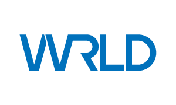
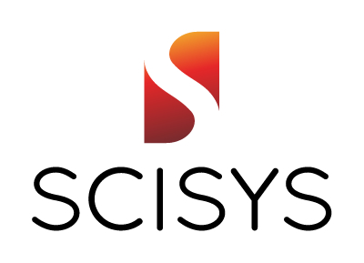

## [FOSS4G UK 2018](/foss4guk2018/) : Sponsors

We want to keep the cost of entry to FOSS4G UK as low as possible - sponsorship will help us to do that. If you are interested in sponsoring FOSS4GUK, there are opportunities for the smallest to the largest companies, and even for one man bands.

FOSS4G UK thanks our generous sponsors.

---

If your idea needs location information to make it work, [Geovation](https://geovation.uk) is for you. We’re all about experimenting and developing your ideas. Get creative and be among like-minded people. You could be a keen innovator with big plans, a developer with the know-how, an entrepreneur looking to make a difference, a data scientist with a passion to explore, or you might have a PhD under your belt. Location is everywhere, and our mission is to expand its use in the UK’s innovation community. Spend time at our London innovation lab - it's for individuals, SMEs and corporate organisations alike. Position your idea to take off commercially, with help from our accelerator programme. Help tackle social, environmental or economic issues by getting involved in our thematic challenges. Come and pay us a visit!

---

At [Esri](http://www.esriuk.com) we believe that the OS geospatial community of developers has a vital role to play, working alongside the broader GIS community, in delivering world-class geospatial solutions to customers.  FOSS4GUK 2018 is a great opportunity for us all to collaborate, engage with and learn from the community as a whole.

---

At [Astun](http://www.astuntechnology.com) we are passionate about geography and passionate about open (source, standards and data), and to be honest we are a bit geeky. We believe that the power of geography can enable our clients to manage assets more efficiently, inform better decisions, improve services and drive down costs. We want to help you to realise those benefits via an open and transparent business model that does not penalise clients when their demand increases or needs change, and which allows us to run a successful and sustainable business.

We believe that open source is a game changer within our industry that delivers robust, scalable technology, and market leading value through a collaborative model that matches the way we and our clients want to work.

---

[CARTO](http://www.carto.com) is the platform for turning location data into business outcomes. CARTO’s open cloud platform offers visual insights on where things happen, why they happen, and predict what will happen in the future. We accelerate innovation, find efficiencies, power new use cases, and disrupt business models through the use of Location Intelligence.

---

Location Planning experts providing data and consultancy for industries across the globe. We have extensive retail and demographic data which we use along with our expertise to find the right network strategy solution for our customers.

---

WRLD produces a dynamic 3D mapping platform for smart cities and buildings, gaming, AR/VR experiences, and more. We provide all the tools you’ll need to quickly develop or embed an engaging, high-performance, custom mapping experience with our cross-platform SDK and APIs. Anyone can create and publish rich, dynamic 3D maps, no coding required. Write once, make it available on web and mobile apps.

---

[Axis Maps](http://www.axismaps.com) has been building custom interactive maps for over 10 years for a wide range of public and private clients. Based in the US and UK, this team of designers, developers, and cartographers focuses on bringing the traditions of cartography to the web.

---

Free and open source software has been part of our technical and organizational foundation since Google’s early beginnings. Last year for example we released Cartographer, a real-time simultaneous localization and mapping (SLAM) library in 2D and 3D and Google Earth Enterprise (GEE), the enterprise product that allows developers to build and host their own private maps and 3D globes.  For more details see [https://opensource.google.com/] or contact [eparsons@google.com](mailto:eparsons@google.com)

---

[SCISYS](http://gis.scisys.co.uk) are a software development house. We have with a long track record of integrating geospatial capabilities to deliver enterprise scale location based services. Increasingly this means connecting multiple data sources or exposing open data. This is where open standards and open source approaches bring real benefit. Operating in a number of domains recent open source projects include for MoD, Met Office, Defra, Forestry Commission and UK PowerNetworks.

---
