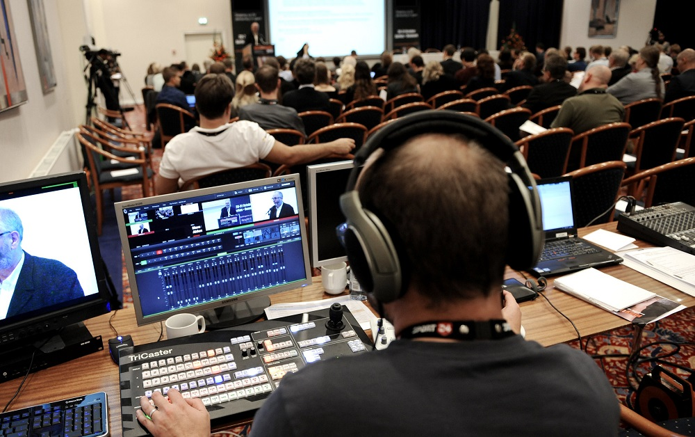

<h2 style="margin-top:0;">Live Streaming</h2>

All our talks will be streamed  on YouTube so you can catch all the action from anywhere in the world. The links to both streams will be made **available soon**, so watch this space!

This is a fantastic opportunity to see a large range of excellent talks, made freely available to anyone. Please share this chance with as many people on possible! We're using the hashtag **#foss4guk2019** across social media...

* Take a look at our **[2019 Programme](FOSS4GUK_2019_Programme.pdf "FOSS4GUK 2019 Programme"){:target="_blank"}** - packed full of interesting talks & workshops!
* All the **[Talk Abstracts](FOSS4GUK_2019_Abstracts.pdf "FOSS4GUK 2019 Talk Abstracts"){:target="_blank"}** are available too.

Our live streaming has been made available by the kind sponsorship of **[Astun Technology](https://astuntechnology.com/ "Astun Technology"){:target="_blank"}**.

Simultaenous streams will be avialable from both rooms

