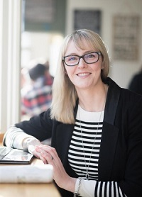
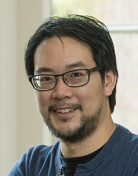
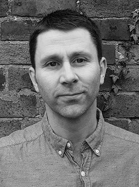
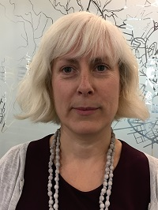

<h2 style="margin-top:0;">Keynote Speakers</h2>

<h3 style="margin-bottom:0; padding-bottom:0;">Denise McKenzie</h3>
<em>Consultant | AGI Board Member | LBMA Global Advisory Board</em>

Denise is an Aussie who lives in England in the historic town of Winchester. A global geospatial specialist Denise has worked in the industry for nearly 20 years evangelising the benefits, value and application of geospatial information across Government, Private Sector and Academia in domains including Smart Cities & IoT, Agriculture, Defence, Marketing, Insurance and many more. She has worked with UNGGIM for the past 6 years leading the development of the UNGGIM Geospatial Standards Guides in collaboration with ISO and IHO and leading OGC's Communication and Outreach Program globally.  Denise is also a member of the Board of the Association for Geographic Information in the UK and the Global Advisory Board for the Location Based Marketing Association. Prior to her role with OGC, she worked for over 12 years with the Victorian Government (Australia) in areas of geospatial strategic policy, collaboration and innovation.

 

<h3 style="margin-bottom:0; padding-bottom:0;">Neil Chue Hong</h3>
<em>University of Edinburgh</em>

Neil Chue Hong is the PI and Director of the Software Sustainability Institute, a national facility for cultivating world-class research through software, led by the University of Edinburgh and funded by all seven of the UKRI Research Councils. He is the Editor-in-Chief of the Journal of Open Research Software, chair of the EPSRC Strategy Advisory Team on e-infrastructure, co-editor of "Software Engineering for Science" and co-chair of the SE4Science workshop series, co-author of "Best Practices for Scientific Computing" and "An Open Science Peer Review Oath", and a member of the OECD Global Science Forum Expert Group on Digital Skills for Science and The Carpentries Advisory Council. His current research interests include barriers and incentives in research software ecosystems and the role of software as a research object. From 2007-2010, Neil was Director of OMII-UK, which provided and supported free, open-source software to the UK e-Research community. He received an MPhys degree in computational physics from the University of Edinburgh.

 

<h3 style="margin-bottom:0; padding-bottom:0;">Alasdair Rae</h3>
<em>University of Sheffield</em>

Alasdair is an urban and regional analyst who likes to make maps that help him understand things better. He works at the University of Sheffield in the Department of Urban Studies and Planning and his recent academic work has focused on topics such as local government boundary reform, the rise of short-term lets, functional regions, housing markets, deprivation, inequality and a few other things. He uses a mix of different kinds of software in his work but he loves open source and has been a big fan of QGIS for a few years now. He also likes to share his work on twitter (@undertheraedar) and on his blog (www.statsmapsnpix.com), where he also sometimes publishes tutorials and shares data. He's delighted to have been asked to speak at FOSS4GUK 2019 and is really looking forward to the workshops, learning new stuff, and meeting up with friends old and new.

 

<h3 style="margin-bottom:0; padding-bottom:0;">Shona Nicol</h3>

<em>The Scottish Government</em>

Shona is the Head of the Geographical Information Science and Analysis Team (GI-SAT) in the Scottish Government Digital Directorate and sits on the Association of Geographic Information (AGI) Scotland Executive Committee. Shona has worked in GI-SAT since 2001, as a GIS Analyst, Operations Manager and now as Team Leader. The team provide a centre of excellence for geospatial data in the public sector, unlocking its value using geospatial and data science tools and techniques. Her primary responsibilities include managing a number of collaborative data procurements - the One Scotland Mapping Agreement (OSMA) with Ordnance Survey and a number other agreements for aerial photography, web services and addressing. She also supports the various Scottish public sector geospatial groups in their role of promoting and developing the use of geospatial data in Scottish Government and in the wider public sector, ensures that Scottish Ministers' obligations under the Inspire Directive are met and that the Scottish Spatial Data Infrastructure is delivered successfully. She is currently developing a shared, cross sector vision on geospatial. Prior to joining GI-SAT, Shona studied at the University of Edinburgh obtaining an MSc in Geographical Information Science.

