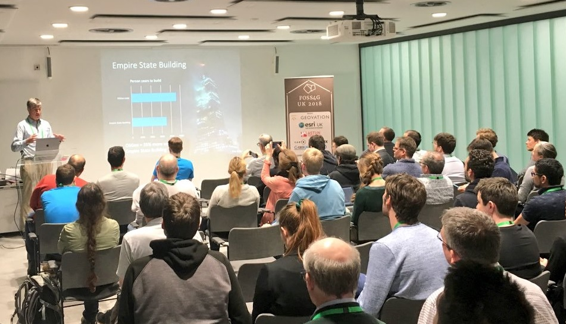

<h2 style="margin-top:0;">Talks & Workshops</h2>

Our call for talks & workshops ended on 30th April and we've had lots of amazing submissions on both fronts, so we're looking forward to a fantastic few days! It'll be a friendly, relaxed conference where we discuss all things free, open source and geo-related.

Take a look at our [draft programme](FOSS4GUK_2019_Programme_draft.pdf "FOSS4GUK 2019 Draft Programme").

Tickets are *£80 for the two day conference*, including lunch and refreshments and will be released in Jule 2019.

<h3 style="margin-top:40px;">Unconference</h3>
If you've missed the talks deadline but still have something you'd like to say, there will also be an opportunity during to contribute to an 'unconference' session - this is likely to be an informal session of lightning-style talks (more details closer to the event).

Photo <a href="https://twitter.com/JohnSMcCrae/status/972147230089113600" target="_blank" alt="John McCrae on Twitter" title="John McCrae on Twitter">&copy; John McCrae</a>

--------------------------------