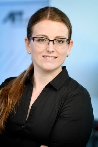

## FOSS4G:UK Local 2022

[OSGeo:UK](https://uk.osgeo.org/) will be bringing together all those interested in free and open source software for geospatial (FOSS4G) for this fantastic event. If you use, promote, develop or want to learn about open source tools and open data for geospatial, then this conference is for you! A whole day of talks, workshops and networking across the UK. Take a look at our previous programmes for [FOSS4GUK Online 2020](https://uk.osgeo.org/foss4gukonline2020/programme.html) and [FOSS4GUK 2019 in Edinburgh](https://uk.osgeo.org/foss4guk2019/FOSS4GUK_2019_Programme.pdf) to get a flavour of things to come!

We are running FOSS4G:UK Local 2022 on Thu 17th Nov 2022, on [PostGIS](https://postgisday.rocks/) day. This will be a hybrid conference, but with a twist: there will be no central physical location. We have nine venues geographically dispersed across the UK, where you can physically meet up to attend the conference. The three keynote presentations and some additional sessions will be streamed to all venues. Additional sessions will be run at each local venue.

If you haven't been able to get a ticket to an in-person event, or can't attend one, we are streaming some of FOSS4G:UK Local 2022 on our [YouTube channel](https://www.youtube.com/c/FOSS4GUK/streams). The full agenda for all venues, with links to each session is [here](https://docs.google.com/spreadsheets/d/1ChtOtqO0PfZ2ckiZqqJxyV3VhP3Xm-WnkJ6NwZ2UVTM), and details of how to follow online are in the [Online](online.html) page under Venues below. You can ask questions too, using the YouTube chat option.

You are also welcome to chat with other online participants through the OSGeo:UK Matrix Room: [#OSGeoUK:matrix.org](https://matrix.to/#/#OSGeoUK:matrix.org). Check out this [page](https://nickbearman.github.io/installing-software/element-matrix-public) for details on how to sign up. All participants are expected to follow the [Code of Conduct](https://uk.osgeo.org/foss4guk2022local/code-of-conduct/). 

## Venues

These are our local venues.

Location | Chair(s)
--- | ---
[Bovey Tracey (Dartmoor National Park)](boveytracey.html#foss4guk-local-2022---bovey-tracy-dartmoor-national-park-offices) | [Dave Barter](https://twitter.com/NautoGuide) & [Matt Travis](https://twitter.com/yakus)
[Bristol](bristol.html#foss4guk-local-2022---bristol-engine-shed-bristol-temple-meads) | [Ant Scott](https://twitter.com/antscott) & [Alastair Graham ](https://twitter.com/ajggeoger)
[*Cardiff - Sold out*](cardiff.html#foss4guk-local-2022---cardiff-jurys-inn) | [Kevin Williams](mailto:Kevin.Williams001@gov.wales)
[Glasgow](glasgow.html#foss4guk-local-2022---glasgow-university-of-glasgow) | [Tom Armitage](https://twitter.com/MapNav_Tom) & Ana Basiri
[*Keyworth - Sold out* (British Geological Survey)](keyworth.html#foss4guk-local-2022---keyworth-british-geological-survey) | [John Stevenson](mailto:jostev@bgs.ac.uk) & [Chris Williams](mailto:chrwil@bgs.ac.uk)
[Leeds](leeds.html#foss4guk-local-2022---leeds-platform)	| [Mike West](mailto:foss4g@addresscloud.com) & [Tomas Holderness](mailto:foss4g@addresscloud.com)
[*London - Sold out*](london.html#foss4guk-local-2022---london-clyde--co-fenchurch-st) | [Simon Miles](https://twitter.com/geosmiles)
[Manchester](manchester.html#foss4guk-local-2022---manchester-the-university-of-manchester) | [Jonny Huck](https://jonnyhuck.co.uk)
[*Southampton - Sold out* (Ordnance Survey)](southampton.html#foss4guk-local-2022---southampton-ordnance-survey) | [Paul Wittle](mailto:paul.wittle@dorsetcouncil.gov.uk) & [Paul Naylor](mailto:paul.naylor@os.uk)
*National Chair* | [Nick Bearman](https://twitter.com/nickbearmanuk)
[Online](online.html) | View most sessions online if you can't make a local event 

## Call for Talks

The Call for Talks is now closed - we have been in touch confirming if your talk has been accepted. 

Any general queries please contact the national chair, Nick Bearman or osgeouk@gmail.com. Any venue specific query please contact the local venue chair, listed above.

## Schedule

The national schedule for Thurs 17th Nov 2022 is:
- 09:30 - 10:00 - Opening and welcome
- 10:00 - 10:30 - [Anita Graser](https://anitagraser.com/): Shaping Open Spatial Data Science
- 10:30 - 11:00 - [Tim Sutton](https://kartoza.com/the_team/HR-EMP-00002/): 20 Years of QGIS: Successes and Failures of a Global Phenomenon
- 11:00 - 16:00 - local arrangements
- 16:00 - 16:30 - [Regina Obe](https://twitter.com/reginaobe): PostGIS Vision: Past, Present, and Future
- 16:30 - 16:45 - Wrap-up
- 16:45 onwards - local arrangements

For the full programme, with details of speakers and talk descriptions, and links to streamed versions of the sessions (coming soon) see [here](https://docs.google.com/spreadsheets/d/1ChtOtqO0PfZ2ckiZqqJxyV3VhP3Xm-WnkJ6NwZ2UVTM).

The local venue programmes are also on the venue pages above - there will be sizable networking opportunities as well as lunch, alongside the sessions!

## Keynote Presentations

We are delighted to have keynote presentations from three leading contibutors to open source GIS worldwide: [Regina Obe](https://twitter.com/reginaobe), [Tim Sutton](https://kartoza.com/the_team/HR-EMP-00002/), and [Anita Graser](https://anitagraser.com/) - these will be streamed live to all the venues.

 [Anita Graser](https://anitagraser.com/) |  [Tim Sutton](https://kartoza.com/the_team/HR-EMP-00002/) |  [Regina Obe](https://twitter.com/reginaobe)

## Registration

[Registration is now open!](https://www.eventbrite.co.uk/e/foss4g-uk-local-2022-tickets-405826868087) Follow us on [Twitter](https://twitter.com/osgeouk) / [#FOSS4GUK](https://twitter.com/search?q=%23FOSS4GUK&src=typed_query), join our [mailing list](https://lists.osgeo.org/mailman/listinfo/uk), and keep an eye on this site for more details.

The event is free to attend but we *strongly* encourage attendees (and/or their employers) to make a donation of £20 (more if you can afford or less if you can't) to one of these causes:

### OSGeo:UK

<form action="https://www.paypal.com/cgi-bin/webscr" method="post" target="_top">
<input type="hidden" name="cmd" value="_s-xclick">
<input type="hidden" name="hosted_button_id" value="42G7PKK5YV6NU">
<input type="image" src="https://www.paypalobjects.com/en_US/GB/i/btn/btn_donateCC_LG.gif" border="0" name="submit" alt="PayPal – The safer, easier way to pay online.">

</form>
 

### MapAction 
[ MapAction](https://mapaction.org/donate/)

## Code of Conduct
Participants at FOSS4G:UK Local 2022 are expected to act respectfully toward others in accordance with the [FOSS4G:UK Online Code of Conduct](code-of-conduct). *Short version: everyone is welcome, make everyone welcome, be nice.*

## Contact
[@OSGeoUK](https://twitter.com/osgeouk) or .

&nbsp;

<!-- Jonny Huck Email Obfuscator -->
<!-- Simply add...    ...wherever you would like the email link to appear -->

