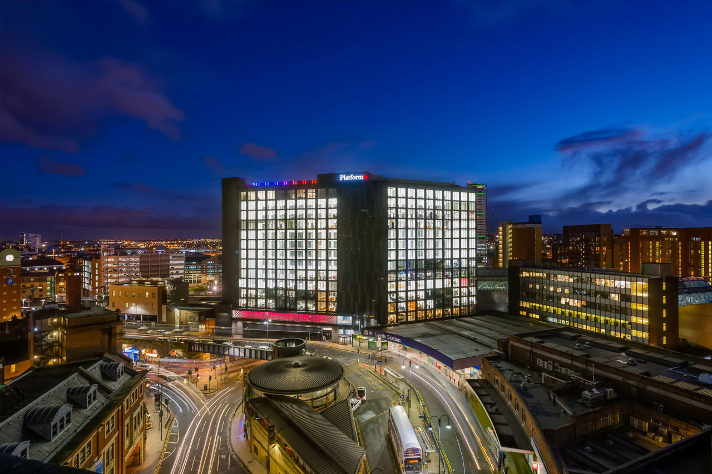

## FOSS4G:UK Local 2022 - Leeds (Platform)

Local Venue Chairs: [Mike West](mailto:foss4g@addresscloud.com) & [Tomas Holderness](mailto:foss4g@addresscloud.com)

### Sponsors
We are very grateful for the support of [Addresscloud](https://www.addresscloud.com/) and [JBA](https://www.jbarisk.com/) for sponsoring FOSS4G:UK Local at this event. 

### Call for talks

The Call for Talks is now closed. We will be in touch soon confirming if your talk has been accepted. 

For more details see [here](https://uk.osgeo.org/foss4guk2022local/index.html#call-for-talks).

### Location & Travel
[Platform](https://www.openstreetmap.org/#map=19/53.7949385/-1.5466345) 
New Station St 
Leeds 
LS1 4JB 

Website: [https://bruntwood.co.uk/our-locations/leeds/platform/](https://bruntwood.co.uk/our-locations/leeds/platform/)

Getting there: Platform is adjacent to Leeds train station meaning that it is excellently served by both train and bus services.

We encourage everyone to travel by public transport/car share/under their own steam if possible.

### Programme

The schedule for Thurs 17th Nov 2022 is below - for the full programme for all venues, with details of speakers and talk descriptions, see [here](https://docs.google.com/spreadsheets/d/1ChtOtqO0PfZ2ckiZqqJxyV3VhP3Xm-WnkJ6NwZ2UVTM).

Time | Speaker | Title
:-----|:-----|:-----
09:15 - 09:30|*Coffee and local welcome*
09:30 - 10:00|Nick Bearman|[Opening and welcome](https://youtu.be/DLwNwLpkwOI)
10:00 - 10:30|[Anita Graser](https://anitagraser.com/) (online) |[Shaping Open Spatial Data Science](https://youtu.be/Iza34-rtQ4A)
10:30 - 11:00|[Tim Sutton](https://kartoza.com/the_team/HR-EMP-00002/) (online)| [20 Years of QGIS: Successes and Failures of a Global Phenomenon](https://youtu.be/UJWmX16rVQc)
11:00 - 11:30| *Break (coffee and networking)*
11:30 - 12:00 | Dennis Bauszus |Composing Software: Spatial for the JAMstack generation
12:00 - 12:30 | Peter Wells	| [Mergin Maps: an open source platform for your field data collection](https://youtu.be/iPUW3ljOMwo)
12:30 - 13:20 | *Lunch (food provided)*
13:20 - 13:30 | Chris Larkin | [Prioritisation of Obstruction Removal on Active Travel Networks (Lightning Talk)](https://youtu.be/b9G5EH1w4QA)
13:30 - 13:40 | Clara Peiret-Garcia | [Developing an inclusive accessibility index for UK cities. (Lightning Talk)](https://youtu.be/PKmRHgseH8A)
13:40 - 13:50 | Rachael Sanderson | [Experimenting with Social Media data using Open Source Software (Lightning Talk)](https://youtu.be/rYrlvyZ-m40)
13:50 - 14:10 | Oliver Burdekin	| [FOSS meets not FOSS (Show & Tell)](https://youtu.be/aHqUXbbfHGE)
14:10 - 14:40 | David Wood | [APIs for assessing flood risk anywhere in the world](https://youtu.be/T6yEnAwCHFI)
14:40 - 15:10 | Tomas Holderness | [Serverless Tile Services in the Cloud](https://youtu.be/c5MR2CmM6-M)
15:10 - 15:30 | *Break (coffee and networking)*
15:30 - 16:00 | Michael West | [PostGIS Out-DB Rasters in AWS Batch](https://youtu.be/wJKMtRas5tQ)
16:00 - 16:30|[Regina Obe](https://twitter.com/reginaobe) (online)|  [PostGIS Vision: Past, Present, and Future](https://youtu.be/xnF0PqMB3cI)
16:30 - 16:45|Nick Bearman| [Wrap up](https://youtu.be/HDgwwCYhBts)
16:45 onwards|*Local arrangements*

### Registration

[Registration is now open!](https://www.eventbrite.co.uk/e/foss4g-uk-local-2022-tickets-405826868087)

The event is free to attend but we *strongly* encourage attendees (and/or their employers) to make a donation of £20 (more if you can afford or less if you can't) - see [here](https://uk.osgeo.org/foss4guk2022local/index.html#registration) for details.
