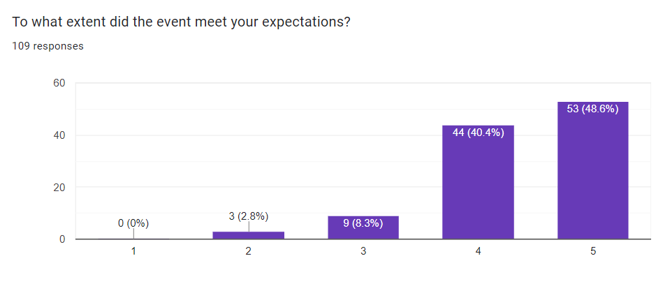
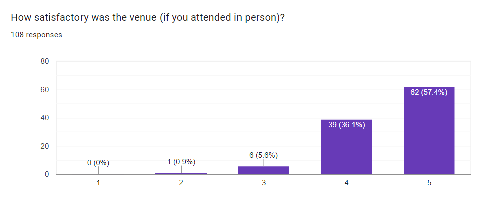
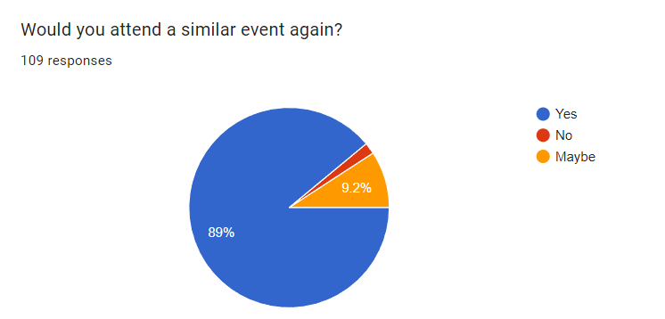

## FOSS4G:UK Local 2022 - Lessons Learned

We had a great FOSS4G:UK Local 2022 conference on Thurs 17th Nov, PostGIS day. We reached about 300 people across the nine venues, which is many more than we've previously been able to reach at an in person event. We raised about £3500 for OSGeo:UK which will go towards our funding of [Open Source Geospatial software](https://uk.osgeo.org/pastdonations.html). Videos for most of the sessions are now available and linked from the programme on the website. We are still waiting for videos from Cardiff and Glasgow and we will post those shortly.

Below is a short summary of the [feedback](#feedback) we've received, as well as a description of our [technical setup](#technical-setup), and a few lessons learned for next time (both technical and non-technical!). 

## Feedback

We received 108 responses to the feedback form (~40% of attendees), with 88% saying the conference 'Met or exceeded their expectations' (score 4 or 5 out of 5), 88% rated the quality of the talks as 4 or 5, and 90% rated the venues as 4 or 5. The local venue format worked well, with 90% saying they would attend again, and 57% would like the same format again (national talks streamed and local events across the country). 

  

Overall, the in-person element worked very well and we were proud to get around 300 people attending overall. Sign-ups were great, and we reached capacity at most venues. 

We had a good crowd of volunteers, including some new faces and groups which was ideal. Thanks to everyone who stepped up and got involved. 

Anyone who attended, watched online or tried to stream the talks would know we has some technical issues. At the beginning these were issues related to the YouTube streaming keys being reset - we need to minimise the number of people who have access to this and will be stricter on our YouTube permissions next time!

In general the streaming worked well, but this was the first time any of us had run something like this, so we tried to manage everyone's expectations during the day, and keep everyone updated. Next time, we would have fewer streams, maybe one per venue rather than one stream per presentation. This will minimise the switch over time. Additionally this will also mean the video clips need cutting up afterwards before being made available on YouTube, but it is a relatively small admin task for a better in person experience. 

We also had a number of venue specific issues, in terms of sound and video quality. This very much depended on the venue and facilities available. For rooms with in-room amplification this made recording and streaming even more complex and we had a number of issues with feedback. Testing is key for this and next time we want to insist on in venue testing before the day. We tried this this time but it was tricky with scheduling rooms and people to be in the right place, but we should have pushed harder for this. Using one laptop for presentations (and asking people to submit slides beforehand) will also help with this, and ensuring we have better ways of managing in person and remote questions, so both people in the room and online can hear the questions and get their questions answered. 

Related to this, we think 9 venues is probably a bit too many, and we could do with fewer venues (e.g. 4 or 5 across the UK) and I think we would still get a good range of attendees. We could also be a bit more selective about presentations - in fact, we only turned down one presentation across the whole conference this time. 

Attendance was highly varied - some venues had slightly over 100% attendance, and some down as low as 40%. Low attendance not only means that people who might have attended couldn't, it also means we ended up over ordering on catering. Next time we'd recommend a small fee (e.g. £20) to secure a ticket). This would be refundable if you cancelled with sufficient notice before the conference, and we would make free tickets available and/or setup a fund to support those who want to attend but for who this fee would be a barrier. 

Finally, we also had some feedback about our lack of diversity in speakers. We are aware this is a problem in the open source and geospatial communities, and something we proactively addressed with our selection of keynotes. In some venues we did reasonably well with diversity (e.g. Glasgow) and in some venues we did not do so well. We've received a range of useful suggestions to try to address this and as Chair I will take this on going forward. If you have any other suggestions please do get in touch. 

We tried to get feedback from those who didn't / couldn't attend the conference by asking for input from the mailing list, but that survey did not receive any responses. If you did not manage to attend, but wanted to and we have not captured your feedback, please do get in touch. We want to give access to all members of OSGeo:UK (remember membership is just joining the mailing list, and anyone can join) so please tell us if we have missed anything!

## Technical Setup

We had a few queries about how we setup the streaming technically, so here are some details. 

We used Jitsi and streaming to YouTube for this. The national keynote presentations were quite straight forward - we setup a Jitsi call and the speaker (e.g. Anita) and chair (Nick) joined, along with Amy (our technical guru). Amy streamed from Jitsi to YouTube. She setup a YouTube stream for each talk. This gave a) an entry on YouTube and b) a streaming key. This key was then entered in YouTube, you then press "Go Live" and you are live on YouTube. All of the local venues could either join the Jitsi meeting, or watch the YouTube stream. *For the welcome session, to get the local sessions to share their cameras, they had to be in the Jitsi meeting.* We then took questions via YouTube chat or Matrix room and I read the questions out. 

The screen layout wasn't ideal - you could see the Jitsi call interface and the video / preview of the attendees on the call. This could be improved by using something like OBS, which has more flexibility, but is a little more complex to setup. 

We used the same approach for the local venue streaming - but this encountered many more variables which gave us some issues. Each venue had a YouTube stream setup for each talk (which were grouped into playlists on YouTube). Typically each venue had two laptops - a presenter laptop and a host laptop. The presentor laptop connected to the projector in the venue and the Jitsi call. The presenter gave their presentation as normal, with either the laptop mic or a separate standalone mic capturing their audio. 

A separate host laptop was used to a) connect to the Jitsi call and b) stream to YouTube. This person could check for questions coming in (via YouTube or in the room) and ensure the audio/video quality was ok. Having this laptop OUTSIDE the room of the presentation made this job a lot easier. For questions, we asked the presenter to repeat any questions spoken from the audience to online could here. Also, making sure all presenters used the same laptop made this easier, and in the future we would also ask presenters to provide their slides ahead of time. This means they are all ready to go and we can keep the fiddling about between sessions to a minimum. This also rules out on screen demos - which is a slight issue for this type of conference - but it is a balance we have to strike. This is also slightly more demanding in terms of people - you need person A to host the session and person B to be responsible for the tech streaming. Person B also then (in my experience) doesn't get to hear much of the presentation because they are focusing on the technical issues!

This worked reasonably well in venues which were small enough not to need in room amplification. However rooms which did need in room amplification were where we had more issues because making the in room audio and the online audio play together is hard, and gave us a lot of feedback. If you have a venue setup for this with technicians who can help, this is really useful, but unfortunately not all of our venues had this available. 

In the future we'd also brief presentors to make sure they had no small text on their slides. This is good presentation guidance normally, but when looking at a screen though a (potentially) low quality visual feed online, this is even more important. 

So, in summary (from a technical point if view), this can be done and can work well, but remember:
- keep venue numbers lower (e.g. 4/5 for UK)
- do a full presentation test beforehand (even if you have to pay for the venue time to do this)
- make all presentors use one machine (and perhaps ask them to provide slides before the presentation)
- have a designated person chairing the session
- have a separate designated person responsible for streaming and making sure the video and audio are good, and maybe base this person outside the presentation room
- ensure all parties (chair, technical chair, presentor, in person audience and online audience) know how to ask questions so everyone is aware of them

Any further questions, I am very happy to chat about our experiences, and if you try something similar, please let us know!

