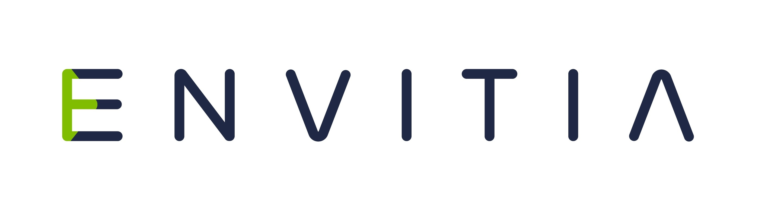

## FOSS4G:UK Local 2022 - Southampton (Ordnance Survey)

Local Venue Chairs: [Paul Wittle](mailto:paul.wittle@dorsetcouncil.gov.uk) & [Paul Naylor](mailto:paul.naylor@os.uk)

### Sponsors

We are very grateful for the support of [Ordnance Survey](https://www.ordnancesurvey.co.uk/) and [Envitia](https://www.envitia.com/) for supporting FOSS4G:UK Local at this event.

### Call for talks

The Call for Talks is now closed. We will be in touch soon confirming if your talk has been accepted. 

For more details see [here](https://uk.osgeo.org/foss4guk2022local/index.html#call-for-talks).

### Location & Travel
[Ordnance Survey](https://www.openstreetmap.org/#map=19/50.93812/-1.47032) 
Explorer House 
Adanac Drive 
Southampton 
SO16 0AS 

Getting there: [https://www.ordnancesurvey.co.uk/contact-us/find-us-page](https://www.ordnancesurvey.co.uk/contact-us/find-us-page)

We encourage everyone to travel by public transport/car share/ under their own steam if possible.

Train: Best station is Southampton Central, then by taxi (about 15 min) or [local bus number 17](https://www.bluestarbus.co.uk/services/BLUS/17).

Car: A visitors car park is available.

### Programme

The schedule for Thurs 17th Nov 2022 is below.

Time | Speaker | Title
:-----|:-----|:-----
09:00 - 09:30|Arrivals and coffee
09:30 - 10:00|Nick Bearman|Opening and welcome
10:00 - 10:30|[Anita Graser](https://anitagraser.com/) (online) |Shaping Open Spatial Data Science
10:30 - 11:00|[Tim Sutton](https://kartoza.com/the_team/HR-EMP-00002/) (online)| 20 Years of QGIS: Successes and Failures of a Global Phenomenon
11:00 - 11:30| Break
11:30 - 12:00 | Andrew Bell | A safe route to school with PgRouting and QGIS
12:00 - 12:30 | Paul Wittle & Robert Quincey | Going open - the journey so far at Dorset Council
12:30 - 13:30 | Lunch
13:30 - 14:30 | Michael Gordon & Tim Martin |	Workshop - Using the OS Data Hub to automate Open Data ETL to open source databases
14:45 - 15:00 | Sarah Cole | Asset Management Applications Using GeoServer, Benefits and Drawbacks? 
15:00 - 15:30 | Break
15:30 - 16:00 | Giovanni Allegri |	State of GeoNode
16:00 - 16:30|[Regina Obe](https://twitter.com/reginaobe) (online)|  PostGIS Vision: Past, Present, and Future
16:30 - 16:45| Nick Bearman| Wrap up
16:45 onwards| Networking and finish

### Registration

[Registration is now open!](https://www.eventbrite.co.uk/e/foss4g-uk-local-2022-tickets-405826868087)

The event is free to attend but we *strongly* encourage attendees (and/or their employers) to make a donation of £20 (more if you can afford or less if you can't) - see [here](https://uk.osgeo.org/foss4guk2022local/index.html#registration) for details.

## Code of Conduct

Participants at FOSS4G:UK Local 2022 are expected to act respectfully toward others in accordance with the [FOSS4GUK Online Code of Conduct](code-of-conduct). *Short version: everyone is welcome, make everyone welcome, be nice.*

### Questions

Any questions, please contact the local venue chairs (details above) or email [osgeouk@gmail.com](mailto:osgeouk@gmail.com).

