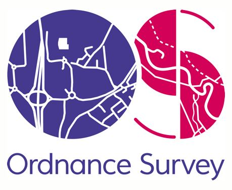

## FOSS4G:UK Local 2022 - Southampton (Ordnance Survey)

Local Venue Chairs: [Paul Wittle](mailto:paul.wittle@dorsetcouncil.gov.uk) & [Paul Naylor](mailto:paul.naylor@os.uk)

### Sponsors

We are very grateful for the support of [Ordnance Survey](https://www.ordnancesurvey.co.uk/) for supporting FOSS4G:UK Local at this event.

### Call for talks
The call for talks in Southampton is [now open](https://forms.gle/HfBkq5LSrDpCfp4G9), and will close on Sun 18th Sept 2022 - please get your proposal in *now* so we can complete the programme below! For more details see [here](https://uk.osgeo.org/foss4guk2022local/index.html#call-for-talks).

### Location & Travel
[Ordnance Survey](https://www.openstreetmap.org/#map=19/50.93812/-1.47032) 
Explorer House 
Adanac Drive 
Southampton 
SO16 0AS 

Getting there: [https://www.ordnancesurvey.co.uk/contact-us/find-us-page](https://www.ordnancesurvey.co.uk/contact-us/find-us-page)

We encourage everyone to travel by public transport/car share/ under their own steam if possible.

Train: Best station is Southampton Central, then by taxi (about 15 min) or [local bus number 17](https://www.bluestarbus.co.uk/services/BLUS/17). 

Car: A visitors car park is available. 

To minimise the carbon footprint of our event, we would ask participants to consider public transport or car sharing where possible. Various lift sharing websites are available, and you are welcome to offer / ask for car sharing in the [OSGeo:UK Matrix room](https://matrix.to/#/#OSGeoUK:matrix.org), or [liftshare.com](liftshare.com) is a car sharing website. *Participants organised lift sharing at their own risk, OSGeo:UK accepts no responsibility for car sharing.*

### Programme

The schedule for Thurs 17th Nov 2022 is:
- 09:00 - 09:30 - Arrivals and coffee
- 09:30 - 10:00 - Opening and welcome
- 10:00 - 10:30 - [Anita Graser](https://anitagraser.com/) (online): Shaping Open Spatial Data Science
- 10:30 - 11:00 - [Tim Sutton](https://kartoza.com/en/people/person/tim/) (online): 20 Years of QGIS: Successes and Failures of a Global Phenomenon
- 11:00 - 16:00 - *local arrangements will be confirmed nearer the time*
- 16:00 - 16:30 - [Regina Obe](https://twitter.com/reginaobe) (online): PostGIS Vision: Past, Present, and Future
- 16:30 - 16:45 - Wrap-up
- 16:45 onwards - local arrangements

### Registration 

Registration link to follow in due course - the event is free to attend but we strongly encourage attendees (and/or their employers) to make a donation of £20 (more if you can afford or less if you can't) - see [here](https://uk.osgeo.org/foss4guk2022local/index.html#registration) for details.

## Code of Conduct

Participants at FOSS4G:UK Local 2022 are expected to act respectfully toward others in accordance with the [FOSS4GUK Online Code of Conduct](code-of-conduct). *Short version: everyone is welcome, make everyone welcome, be nice.*

### Questions

Any questions, please contact the local venue chairs (details above) or email [osgeouk@gmail.com](mailto:osgeouk@gmail.com). 

