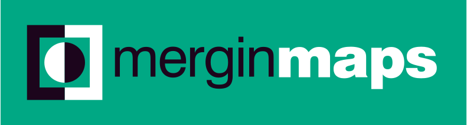

## Sponsors of FOSS4G:UK Local 2022

Many thanks to all of our sponsors. Please do check out their websites:

## Local venue sponsors

<!-- ### Business supporters -->

## National sponsors

For more details, please contact Nick Bearman, and/or . 

<!-- Jonny Huck Email Obfuscator -->
<!-- Simply add...    ...wherever you would like the email link to appear -->
