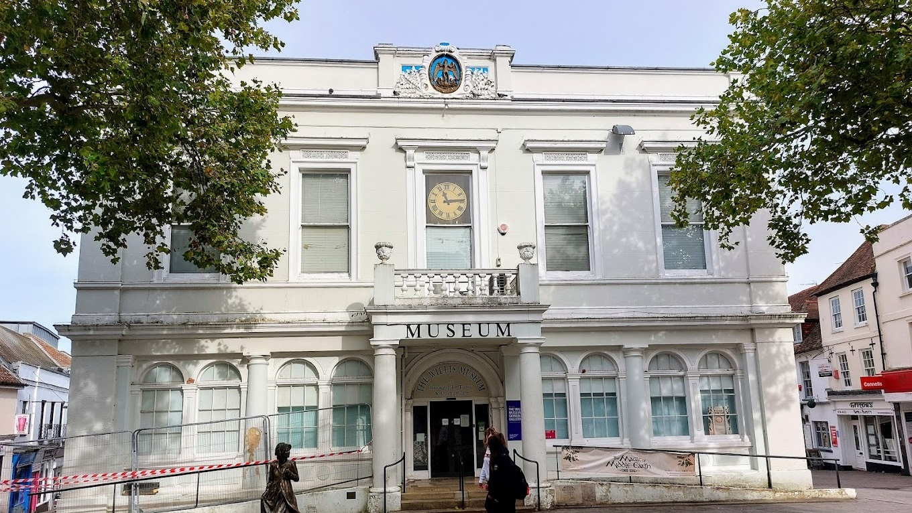

## FOSS4G:UK Local 2023 - Basingstoke

Local Venue Chair: [Simon Miles](mailto:Simon.Miles@geoxphere.com)

### Sponsors

We are very grateful for the support of Geoxphere for sponsoring FOSS4G:UK Local 2023 at this event. 

### Location & Travel

[Willis Museum](https://www.openstreetmap.org/node/616858593#map=16/51.2625/-1.0876) 
Market Place 
Basingstoke 
RG21 7QD 

We encourage everyone to travel by public transport/car share/under their own steam if possible.

### Call for Talks

The call for talks has now *closed*.

### Registration

[Registration](https://www.eventbrite.co.uk/e/foss4g-uk-local-2023-tickets-663598610307){:target="_newpage"} is now open! Join our [our mailing list](https://lists.osgeo.org/mailman/listinfo/uk){:target="_newpage"} to keep up to date with news. 

*Spot a typo or error? Fix on [GitHub](https://github.com/osgeouk/website/blob/gh-pages/foss4guklocal2023/london.md){:target="_newpage"} ([How?](https://uk.osgeo.org/editing-on-github){:target="_newpage"})*
