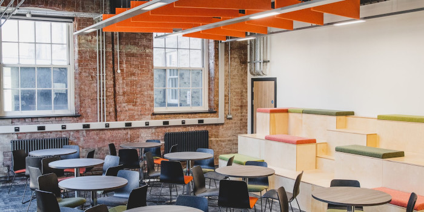

## FOSS4G:UK Local 2023 - Lancaster

Local Venue Chairs: [Barry Rowlingson](https://barry.rowlingson.com/contact.html), [Jonny Huck](https://jonnyhuck.co.uk/)

### Programme

The [Lancaster Programme](lancaster-programme.html) is now online. If you are presenting and 
the time is awkward for you for any reason, let Barry or Jonny know and we'll try and make adjustments.

### Sponsors

We are very grateful for the support of [Fraser House Hub](https://fraserhousehub.co.uk) for supporting sponsorship of the venue for FOSS4G:UK Local 2023 in Lancaster.  

We are also very grateful to the Lancaster University [Data Science Institute](https://www.lancaster.ac.uk/dsi/) for sponsoring 
lunch and refreshments. 

### Location & Travel

* Venue: [Fraser House Hub](https://www.openstreetmap.org/#map=19/54.04438/-2.79759)

* From Lancaster rail station: [about 15 minutes on foot](https://www.openstreetmap.org/directions?engine=fossgis_valhalla_foot&route=54.0481%2C-2.8073%3B54.0444%2C-2.7976#map=16/54.0464/-2.8025)

* From Lancaster bus station: [about 15 minutes on foot](https://www.openstreetmap.org/directions?engine=fossgis_valhalla_foot&route=54.0505%2C-2.8007%3B54.0444%2C-2.7976#map=18/54.05002/-2.80047) or get off at White Cross or the Infirmary and you'll be right in front of 
the site.

* By car: there may be limited guest parking available.

* By canal boat: moor up near Penny Street Bridge.

We encourage everyone to travel by public transport/car share/under their own steam if possible.

### Call for Talks

The call for talks is now closed, but if you are still interested in presenting contact Barry and
there may be space in the programme for lightning talks or announcements.

### Registration

Thanks to generous sponsorship from the Lancaster Data Science Institute you can register **free** for
attendance at Lancaster.
Please contact <a href="mailto:b.rowlingson@gmail.com">Barry Rowlingson (b.rowlingson@gmail.com)</a> for the Eventbrite discount code.

You can then [register via Eventbrite](https://www.eventbrite.co.uk/e/foss4g-uk-local-2023-tickets-663598610307){:target="_newpage"}.
Apply the code at the first registration form for a full discount. You should not be asked for a payment method.

## Staying On

Fraser House is very close to The White Cross pub, which also does food, and if anyone is staying around after
the close of the conference then this will probably be our first call.

Also happening on the day of the conference
is the [Lancaster Jazz Festival](https://www.lancasterjazz.com/2023-festival/) 
(6th to the 10th of September). If you are in Lancaster for the evening then check
out the gig listing on the web site. Grrreat.

Lancaster also has plenty of other restaurants and pubs - ask Barry or any other local
attendees for information.

