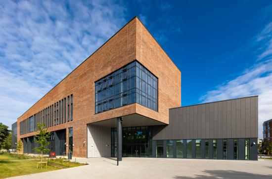

## FOSS4G:UK Local 2023 - Maynooth

Local Venue Chairs: [Peter Mooney](mailto:peter.mooney@mu.ie)

### Sponsors

We are very grateful for the support of OSGeo:IE for sponsoring FOSS4G:UK Local 2023 at this event. 

### Location & Travel
TSI Room 128
[TSI Building](https://www.openstreetmap.org/?mlat=53.38245&mlon=-6.59999#map=19/53.38245/-6.59999) 
North Campus 
Maynooth University 
Co. Kildare 
Ireland 

### Venue Accessibility
The [Technology, Society and Innovation (TSI) Building](https://www.youtube.com/watch?v=VdoNU-tlfwE&t=432s), Maynooth University’s landmark infrastructural development, is designed to enhance the University’s excellence in research, education and skills development for future generations. The building is situated with very generous public space created outside the main entrance. All spaces in the four storey block are accessible to wheelchair users as are all ground floor entrances. Accessible WC facilities are available at entry level and all other levels. 

We encourage everyone to travel by public transport/car share/under their own steam if possible. Information on public transportation options you can use to reach Maynooth University are available on the University webpage [Getting to Maynooth using Public Transport](https://www.maynoothuniversity.ie/location/commuting)

### Registration

[Registration](https://www.eventbrite.co.uk/e/foss4g-uk-local-2023-tickets-663598610307){:target="_newpage"} is now open! Register to join us in Maynooth. 
Join our [our mailing list](https://lists.osgeo.org/mailman/listinfo/uk){:target="_newpage"} to keep up to date with news. 

### Programme - Thursday 7th September 2023

#### National keynotes - these will be streamed to watch at our local venue in Maynooth at the start and end of day

Session|Time | Speaker| Title|
:-----|:-----|:-----|:-----
Local Arrivals|09:00 - 09:30|-|Local arrivals, registration, and networking
Local Arrivals|09:30 - 09:45|-|Local welcome and overview / coffee and networking
STREAMED|09:45 - 10:15|Helen McKenzie|Geospatial Evangelism (streamed)

#### Local session timetable at Maynooth

Session| Time | Speaker| Title|
:-----|:-----|:-----|:-----
Local Session #1|10:15 - 10:45|Adriaan Keurhorst|**Deep learning and Sentinel-1 for grazing detection in Ireland**
Local Break|10:45 - 11:15|-|Coffee/tea break (local)
Local Session #2|11:15 - 11:45|Kevin Credit|**The Walkable Accessibility Score: A spatially-granular open-source measure of walkability for the continental US from 1997-2019**
Local Session #2|11:45 - 12:15|Hrishikesh Ballal|**Urban Sprawl toolkit with open tools**
Local Session #2|12:15 - 12:45|Paddy Gorry|**Randomly generated spatial datasets - a Python approach**	
Local Lunch|12:45 - 13:45|-|Lunch served at venue room (local)
Local Session #3|13:45 - 14:15|**Paul Holloway|Using FOSS4G to meet UN Sustainable Development Goal (SDG) targets**
Local Session #3|14:15 - 14:30|Peter Mooney|**FOSS4G in the classroom: observations and ideas**
Local Session #3|14:30 - 14:45|Everyone locally|**Unconference - discussion of next steps for OSGeoIE** 

#### National keynotes - these will be streamed to watch at our local venue in Maynooth at the start and end of day

Session|Time | Speaker| Title|
:-----|:-----|:-----|:-----
STREAMED|14:45 - 15:15|Ujaval Gandhi|Geospatial Careers (streamed)
Local Break|15:15 - 15:30|-|Coffee/tea break (local)
STREAMED|15:30 - 16:30|Panel Session|FOSS4G 2013, 10 years on (streamed)
Local Close|16:30 - 16:45|Venue Chair|Wrap up, thanks and goodbye. 

### Call for Talks

The call for talks has now *closed*. However, there is still some flexibility if you would really like to tell us about your experiences with FOSS4G and related tools and data. Please contact [Peter Mooney](mailto:peter.mooney@mu.ie) if you would like to explore this opportunity. 

*Spot a typo or error? Fix on [GitHub](https://github.com/osgeouk/website/blob/gh-pages/foss4guklocal2023/maynooth.md){:target="_newpage"} ([How?](https://uk.osgeo.org/editing-on-github){:target="_newpage"})*
