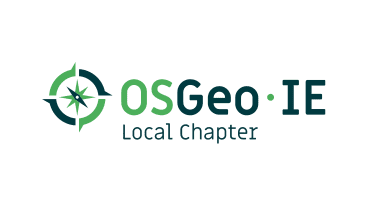
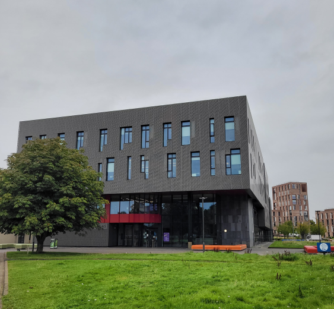

## FOSS4G:UK Local 2023 - Maynooth

Local Venue Chairs: [Peter Mooney](mailto:peter.mooney@mu.ie)

### Sponsors

We are very grateful for the support of OSGeo:IE for sponsoring FOSS4G:UK Local 2023 at this event. 

### Location & Travel
Lab 019 - Ground Floor
[Eolas Building](https://www.openstreetmap.org/?mlat=53.38475&mlon=-6.60153#map=19/53.38475/-6.60153) 
North Campus 
Maynooth University 
Co. Kildare 
Ireland 

### Venue Accessibility
The Eolas Building is situated in the very heart of the University's North Campus among several of the other science buildings. Outside of the Eolas building is a very generous public space and entrance area. All spaces in the building are accessible to wheelchair users as are all ground floor entrances. Accessible WC facilities are available at entry level and all other levels. 

The Lab 019 is the venue room. This room is a state-of-the-art Computing teaching lab space usually used for Postgraduate teaching and small groups. There are over 30 individual seats in the room set out with generous workspace between each seat station. All of the seat stations are equipped with ergonomic chairs with individual plug sockets and USB outlets. [Eduroam](https://www.eduroam.ie/) WiFi is available in the room for those who have access this network. The public [MU-Guest WiFi network](https://www.maynoothuniversity.ie/it-services/wi-fi) is available to guests who do not have Eduroam access.    

We encourage everyone to travel by public transport/car share/under their own steam if possible. Information on public transportation options you can use to reach Maynooth University are available on the University webpage [Getting to Maynooth using Public Transport](https://www.maynoothuniversity.ie/location/commuting)

### Car Parking
Some delegates will use their cars to reach Maynooth. We are fortunate that September 7th is still considered outside term time - therefore there should be ample parking available throughout the North Campus of the University. This means that you can park in **any properly designated parking space** within the car parks available. Car park 4 and Car park 5A are the closest car parks to the Eolas Building. You will see signs regarding parking permits for these car parks but, happily, permit-based parking will not be enforced until the end of September. This being said, please ensure that you park in a designated space. 

### Programme - Thursday 7th September 2023

#### National keynotes - these will be streamed to watch at our local venue in Maynooth at the start and end of day

Session|Time | Speaker| Title|
:-----|:-----|:-----|:-----
Local Arrivals|09:30 - 09:40|-|Local arrivals, registration, and networking
Local Arrivals|09:40 - 09:45|Peter Mooney|Local welcome and overview
STREAMED|09:45 - 10:15|Helen McKenzie|Geospatial Evangelism (streamed)

# Local session timetable at Maynooth

## Local Session #1 Chair/Host - Daniel McInerney

Session| Time | Speaker| Title|
:-----|:-----|:-----|:-----
Local Session #1|10:15 - 10:45|Adriaan Keurhorst|**Deep learning and Sentinel-1 for grazing detection in Ireland**
Local Break|10:45 - 11:15|-|Coffee/tea break (local)

## Local Session #2 Chair/Host - Daniel McInerney

Session| Time | Speaker| Title|
:-----|:-----|:-----|:-----
Local Session #2|11:15 - 11:45|Kevin Credit|**The Walkable Accessibility Score: A spatially-granular open-source measure of walkability for the continental US from 1997-2019**
Local Session #2|11:45 - 12:15|Hrishikesh Ballal|**Urban Sprawl toolkit with open tools**
Local Session #2|12:15 - 12:45|Paddy Gorry|**Randomly generated spatial datasets - a Python approach**	
Local Lunch|12:45 - 13:45|-|Lunch served at venue room (local)

## Local Session #3 Chair/Host - Hrishikesh Ballal

Session| Time | Speaker| Title|
:-----|:-----|:-----|:-----
Local Session #3|13:45 - 14:15|Paul Holloway|**Using FOSS4G to meet UN Sustainable Development Goal (SDG) targets**
Local Session #3|14:15 - 14:30|Peter Mooney|**FOSS4G in the classroom: observations and ideas**
Local Session #3|14:30 - 14:45|Everyone locally|**Unconference - discussion of next steps for OSGeoIE** 

#### National keynotes - these will be streamed to watch at our local venue in Maynooth at the start and end of day

Session|Time | Speaker| Title|
:-----|:-----|:-----|:-----
STREAMED|14:45 - 15:15|Ujaval Gandhi|Geospatial Careers (streamed)
Local Break|15:15 - 15:30|-|Coffee/tea break (local)
STREAMED|15:30 - 16:30|Panel Session|FOSS4G 2013, 10 years on (streamed)
Local Close|16:30 - 16:45|Peter Mooney|Wrap up, thanks and goodbye. 

### Registration

[Registration](https://www.eventbrite.co.uk/e/foss4g-uk-local-2023-tickets-663598610307){:target="_newpage"} is still open! Register to join us in Maynooth. 
Join our [our mailing list](https://lists.osgeo.org/mailman/listinfo/uk){:target="_newpage"} to keep up to date with news. 

*Spot a typo or error? Fix on [GitHub](https://github.com/osgeouk/website/blob/gh-pages/foss4guklocal2023/maynooth.md){:target="_newpage"} ([How?](https://uk.osgeo.org/editing-on-github){:target="_newpage"})*
