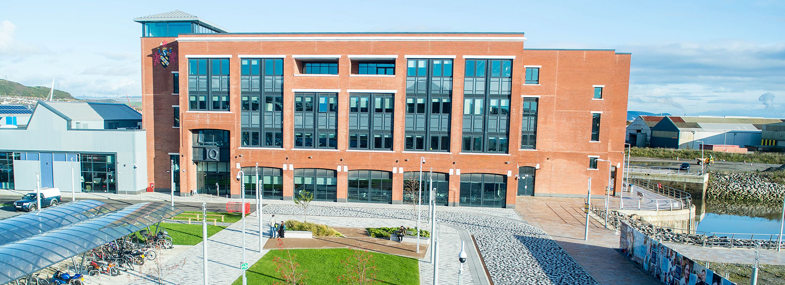

## FOSS4G:UK Local 2023 - Swansea

Local Venue Chair: [Tom Colley](https://uk.linkedin.com/in/tom-colley-59a0376a)

<!--
### Sponsors

We are very grateful for the support of [CGI](https://www.cgi.com/en) for supporting sponsorship of the venue for FOSS4G:UK Local 2023 in Swansea.  

--> 

### Location & Travel

[Lecture room IQ001](https://www.openstreetmap.org/way/1138254725#map=15/51.6145/-3.9275) 
Waterfront 
IQ Campus University of Wales Trinity 
Swansea 
SA1 8EW 

We encourage everyone to travel by public transport/car share/under their own steam if possible.

### Call for Talks

There is still time to submit a talk, but please email Tom directly. [Tom Colley](mailto:tomcolley@gmail.com)

### Agenda

[Morning YouTube stream](https://youtube.com/live/2YpW4FJjoog?feature=share) - [Afternoon YouTube stream](https://youtube.com/live/YrDaCGuT1_o?feature=share)

* 09:00-09:30: Arrive
* 09:30-09:45: Conference Start and Welcome
* 09:45-10:15: Keynote Talk: Helen McKenzie: ["Geospatial Evangelism"](https://uk.osgeo.org/foss4guklocal2023/swansea-programme#geospatial-evangelism) *[Slides](https://docs.google.com/presentation/d/1gM5Yg-Z4i_zLo9ae1bPUJtxPd6TLC9r74N6x7K19nd4/edit?usp=sharing) [YouTube](https://youtube.com/live/HWmgegypNBQ?feature=share)*
* 10:15-10:45: Paul Shapley [Bannau Brycheiniog NPA] ["Updating an Open Source SDI for Mobile Working"](https://uk.osgeo.org/foss4guklocal2023/swansea-programme#updating-an-open-source-sdi-for-mobile-working)
* 10:45-11:15: Coffee Break
* 11:15-11:45: Josh Henley [Welsh Government] ["You're so spatial, let's get engaged!"](https://uk.osgeo.org/foss4guklocal2023/swansea-programme#youre-so-spatial-lets-get-engaged)
* 11:45-12:15: Daniel Clewley [Plymouth Marine Laboratory] ["Building The Welsh Data Cube"](https://uk.osgeo.org/foss4guklocal2023/swansea-programme#building-the-welsh-data-cube)
* 12:15-12:45: Matt Walker [Astun Technology and Rhys Wynne-Jones] ["Building and maintaining Paths to Wellbeing for Ramblers Cymru"](https://uk.osgeo.org/foss4guklocal2023/swansea-programme#building-and-maintaining-paths-to-wellbeing-for-ramblers-cymru)
* 12:45-13:45: Lunch break
* 13:45-14:45: Workshop TBC
* 14:45-15:15: Keynote Talk: Ujaval Gandhi [Google] ["Geospatial Careers"](https://uk.osgeo.org/foss4guklocal2023/swansea-programme#building-a-career-with-open-source-technologies) *[YouTube](https://youtube.com/live/vE9RQBUWWUE?feature=share)*
* 15:15-15:30: Coffee Break
* 15:30-16:30: FOSS4G 2013 Panel Session, [Ten Years After](https://uk.osgeo.org/foss4guklocal2023/ten-years-after.html). *[YouTube](https://youtube.com/live/2UReJqFle_Y?feature=share)*
* 16:30-16:45: Wrap up
* 16:45: Conference close
* 17:00-? : GeoDrinks @ [Beer Riff](https://beerriffbrewing.com/){:target="_newpage"}

### Registration

[Registration](https://www.eventbrite.co.uk/e/foss4g-uk-local-2023-tickets-663598610307){:target="_newpage"} is now open! Join our [our mailing list](https://lists.osgeo.org/mailman/listinfo/uk){:target="_newpage"} to keep up to date with news. 

*Spot a typo or error? Fix on [GitHub](https://github.com/osgeouk/website/blob/gh-pages/foss4guklocal2023/swansea.md){:target="_newpage"} ([How?](https://uk.osgeo.org/editing-on-github){:target="_newpage"})*
