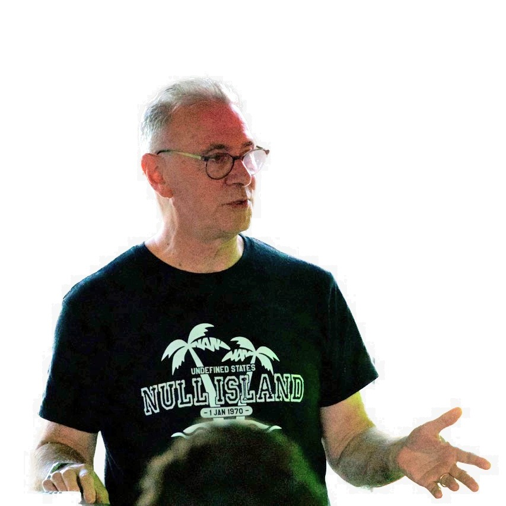
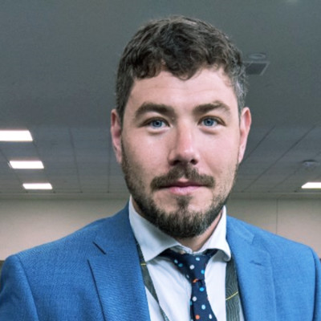
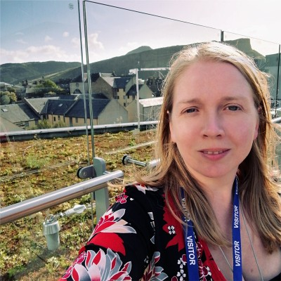
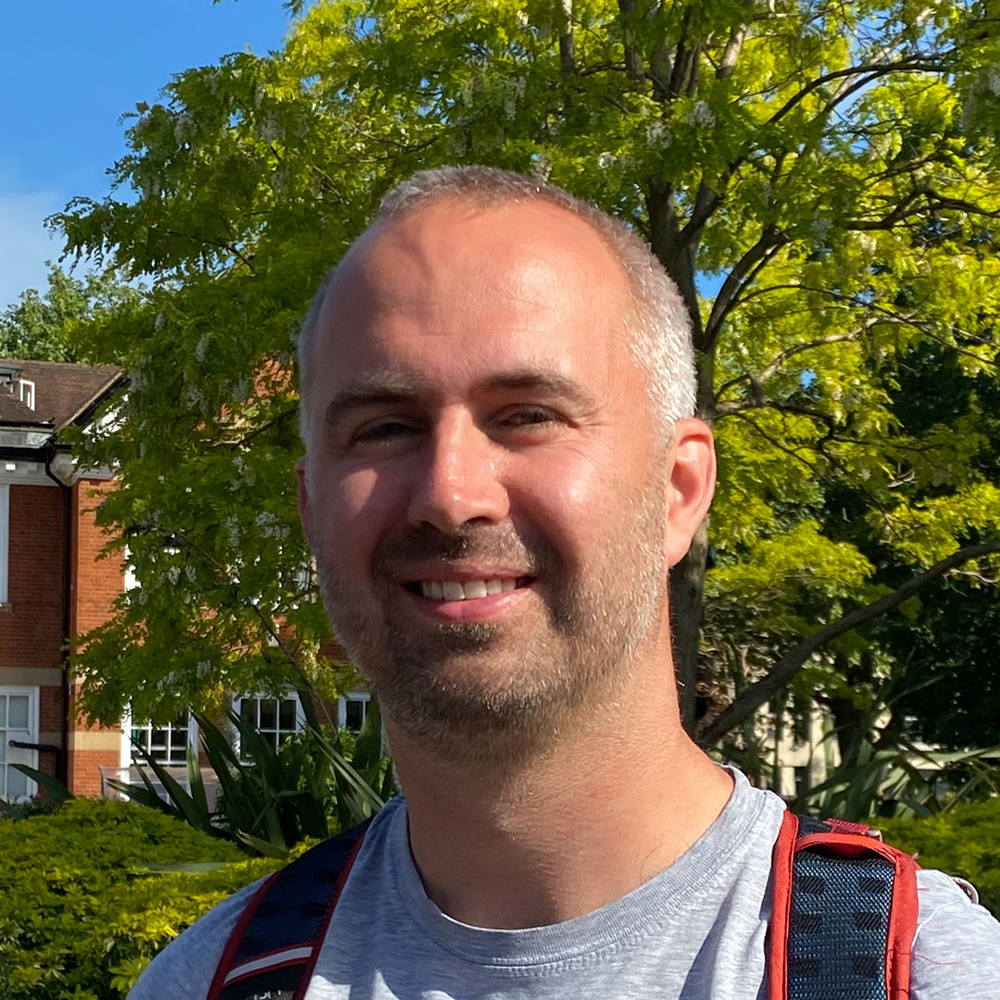

## Panel Discussion: Ten Years After

In 2013 a rag-tag team of UK geo-evangelists produced the 
global [FOSS4G 2013](http://2013.foss4g.org/) conference
in Nottingham, the first (and currently only) time it has
been held in the UK.

For the tenth anniversary of that conference, we have a panel selected
from the team to look at how things have changed in the geospatial
world in the last ten years, and more importantly to look ahead to the
next ten years.

Each member of the panel will have a ten-minute presentation, during
which time we will collect audience questions online, and then
put them, or summaries, to the panel for discussion.

## Panel

   

 * **[Steven Feldman](https://mastodon.me.uk/@stevenfeldman)**: "25 years in geo, ran some companies, invested in and mentored some startups, evangelist for FOSS4G, co-founder of [Mappery](http://mappery.org/), co-host of [geomob podcast](https://thegeomob.com/podcast), wondering if it’s time to stop." 
 
 * **[Mark Iliffe](https://www.linkedin.com/in/iliffemark/)**: Mark will take a look at the global legacy of Nottingham 2013 and how enabling access to open source has changed. 

 * **[Abigail Page](https://www.linkedin.com/in/abipage/)**: Abi will discuss open source/open data in government and the increasing importance of geospatial (e.g. the existence of the Geospatial Commission).
 
 * **[Matt Walker](https://www.astuntechnology.com/about/)**: Principal Geospatial Architect at [Astun Technology](https://www.astuntechnology.com/),  active user, contributor and advocate of open source, OSGeo Charter Member and involved in organising and presenting at a host of OSGeo events. Matt is going to talk tech about the nuts n bolts of open source. 

 
## Moderator

Barry Rowlingson will moderate the panel unless he find someone
else to do it! Volunteers please?!

