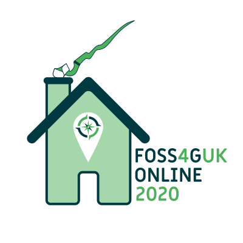

## FOSS4G UK Online 2020

[OSGeo:UK](https://uk.osgeo.org/) are running a one day online FOSS4G event on 17th June 2020. This will give us all a little FOSS4G fix in this strange time, and make a small contribution to the big holes left by the cancellation of IRL FOSS4G events. We'll share some of the work we’ve been doing since the world changed, and maybe pave the way for more online events in future.

## Programme
The schedule for the day is [here](programme.html), and the full session listing of abstracts is [here](sessions.html). This is still subject to change, so keep an eye out for updates.

There are three parallel streams of roughly 30 minutes sessions covering seven themes. All sessions will be recorded so you can catch up later if there are clashes between your favourite topics.

## Tickets/Registration
Registration is open now, and closes at 24:00 on 16th June (unless we are sold out before then). It's fine just to come to one or two sessions, but you will still need to register _before the day_ - this allows us to manage numbers.

Register [on Eventbrite here](https://www.eventbrite.co.uk/e/foss4guk-2020-online-registration-105523419388){:target="_newpage"}.

## Cost
The event is free to attend but we *strongly* encourage attendees (and/or their employers) to make a donation of £20 (more if you can afford or less if you can't) to one of these causes:

* [OSGeo:UK](https://paypal.me/osgeouk)
* [MapAction](https://mapaction.org/donate/)
* A charity of your choice

## Helping out
We (the [OSGeo:UK committee](#who)) would appreciate any help you can provide, either before, during, or after the event - please sign up [here](https://docs.google.com/forms/d/e/1FAIpQLSe6pVdrMBN4BYw6pEfjPXD8z_oRMZWxQ-tvsh2mrwTcn8aP8Q/viewform) if you are able to chip in - for example we will need hosts/co-hosts for sessions.

## News
For regular updates follow us on [Twitter](https://twitter.com/foss4guk)/[#FOSS4GUKOnline](https://twitter.com/search?q=%23FOSS4GUKOnline&src=typed_query).

## When
17th June 2020 - full timings to follow.

## Where
Wherever in the world you are on June 17th... and on Zoom.

## Who
The confererence is organised by the OSGeo:UK Committee:
* [Alastair Graham](https://twitter.com/ajggeoger)
* [Ant Scott](https://twitter.com/antscott)
* [Dave Barter](https://twitter.com/citizenfishy)
* [Jo Cook](https://twitter.com/archaeogeek)
* [Matt Travis](https://twitter.com/yakus)
* [Steven Feldman](https://twitter.com/stevenfeldman)

## How
We will be running the event on Zoom, and we encourage you to [download the latest Zoom client](https://zoom.us/download){:target="_newpage"} for Linux, Windows, Mac, Android or iOS to participate. You do not need to sign up with Zoom to use the client to join our event. There is also an option to connect just using the zoom browser client with reduced functionality.

## On the Day
[Some Practical Guidance for Delegates and Presenters](on-the-day)

## Code of Conduct
Participants at FOSS4G UK Online 2020 are expected to act respectfully toward others in accordance with the [FOSS4GUK Online Code of Conduct](code-of-conduct).

## Acknowledgements
Rosalind Cuttle kindly designed our lovely lockdown logo for us - many thanks to her!

## Contact
[@FOSS4GUK](https://twitter.com/foss4guk) or [foss4guk.osgeouk@gmail.com](mailto:foss4guk.osgeouk@gmail.com).

&nbsp;

